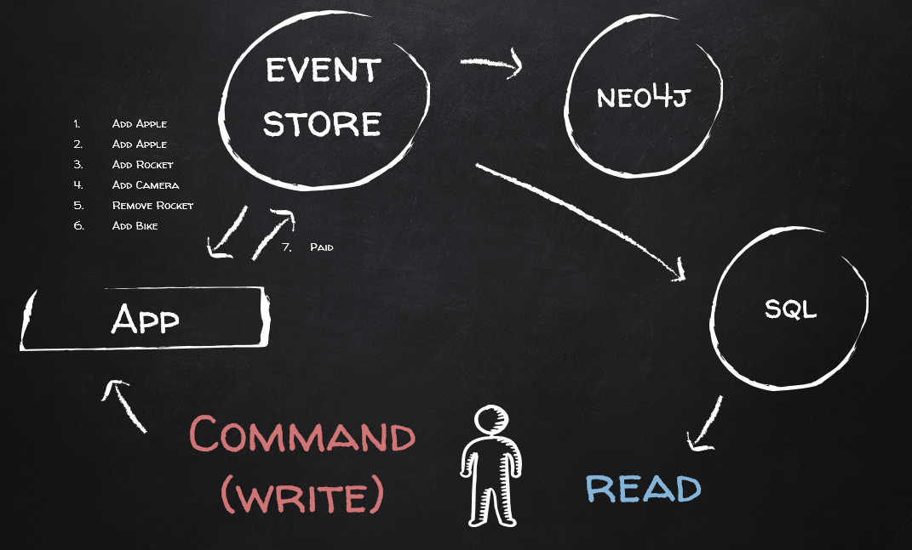

The purpose of **EasyEventSourcing** is to showcase a working Application with implemented business rules, built using an event sourcing architecture. The purpose of this project was to assist myself in understanding how to go about building something using event sourcing and secondly to give others new to the concept a starting point.

* The example tries to be as straightforward as possible, keeping the boilerplate code as simple as possible, while still keeping it usable and maintainable. 
* Explicit implementation is chosen over Magic. This makes it clear what is going on in the system. This also forces us to feel the hurt when making bad decisions (see [8 lines of code](http://www.infoq.com/presentations/8-lines-code-refactoring) by Greg Young). 
* No external libraries are used other than for testing purposes
* Currently an in-memory event store is implemented for simplicity. For real world application use [EventStore](https://geteventstore.com/).

Disclaimer: Although I have experienced the beauty of CQRS and DDD in production applications, I am yet to use Event Sourcing in a production system. The below write up and resulting code was born out of many many hours spent reading, youtubing, thinking, tinkering and arguing about Domain Driven Design, CQRS, Clean Code and Event Sourcing. I am pretty confident in the work but I am always open to correction, suggestions, fixes and pull requests. (This is a work in progress, not all the domain features have been implemented and I am still iffy about some of the command code)

##A Very Simple Overview of Event Sourcing

Event Sourcing is **Command Query Responsibility Segregation (CQRS)**, with the added benefit of no data loss. 

**Command**

Our Audit Log becomes a first class citizen. We store a history of things that happened in our application instead of state (as you would in a traditional database). We store this history as events. To change our system, we take these events, replay them to build up state, apply some command to this state to generate new events. `Events + Command = Event(s)`.

**Query**

We take events, replay them to build up state in appropriate read models that are optimized for our queries.

##A Detailed Overview of the System

Here is the typical flow through the application.

**Command**

1. A Consumer of the application Creates a **Command**.****
2. The Consumer asks application to handle the command by calling the `Send` method on the **CommandDispatcher**.
3. The CommandDispatcher asks the **CommandHandlerFactory** for a **CommandHandler** that can handle the provided Command. CommandHandlers are analogous to Application Services in Domain Driven Design.
4. The Command is given to the relevant `Handle` method on the CommandHandler.
5. The CommandHandler either creates a new **Aggregate** or loads one from the **Repository**.
	* When loading an Aggregate, the Repository will get all the relevant **Events** from the **EventStore**, create a fresh Aggregate and build up the Aggregate state by replaying the events using the `LoadFromHistory` method on the Aggregate.
6. The CommandHandler will call the relevant method on the Aggregate to execute the business logic. The Aggregate will then create the relevant **Events** and apply the state change.
7. The CommandHandler then asks the Repository to save the Aggregate. The Repository asks the Aggregate for the newly created Events and provides them to the EventStore to be persisted.

This concluded writing changes into the app. This entire process is a model of `Events + Command = Event(s)`.

**Query**

Once Events have been persisted to the EventStore, they can be processed by **EventHandlers**. Each Event can be processed by 0 to Many EventHandlers. EventHandlers are responsible for 

1. Building **Read State**. We build up Read Models for the queries we want to run against our data. These models are typically persisted in some sort of database that is optimized for the type of query we have, whether it be relational, graph, document etc. Note that we never query directly from the EventStore, because an EventStore by design is not good at queries.
2. Triggering Commands in different Bounded Contexts. 
3. Triggering some side effect for example sending an email. (This ties into 1. as we typically build up some sort of state (for example an email queue) that we can then read from to trigger some process.)

EventHandlers should be idempotent, meaning they can process the same event multiple times, reproducing the exact same result (for example if we receive the same email triggering event multiple times, we should still only send the email once).

#Implementation Overview
##Messages (Commands and Events)

At the core of any event sourcing implementation is the **Messages** that the application can send. These messages form a contract with the outside world. There are two types of messages

* **Commands** - These are the actions that any consumer of the application can use to change the system. If you want to know what the application does, look at the commands. All commands inherit from `ICommand`.
* **Events** - These are the resulting side effects from sending commands to the system. Events are the main storage component of the application. They are the ultimate truth. If there is not an event, it never happened. They are used to rebuild write state before processing commands, build read state for queries and trigger logic in other bounded contexts. All events inherit from `IEvent`.

Messages are implemented in `EasyEventSourcing.Messages`.

I have chosen to implement all messages using F# records. This provides the following benefits

* Immutable by default - the constructor is implemented by default, reducing the amount of code that needs to be written.
* Structural Equality - this means event equality can be tested directly without the need to override the equals method, thus reducing the amount of code that needs to be written.

##Application
Along with the messages, the **Application** is what the outside world interacts with to change our system. Changes to the system are triggered by sending a command to the Application. The following classes live in `EasyEventSourcing.Application`.

###CommandDispatcher
The CommandDispatcher is the only entry point into our system. It receives Commands via its `Send` method. It requires a `CommandHandlerFactory` to provide it with the matching `CommandHandler`. It then passes the Command to the CommandHandler.

###CommandHandlerFactory
The CommandHandlerFactory resolves `CommandHandlers` based on the type of the command. In this implementation I have chosen not to rely on a typical dependency injection container for resolving dependencies, like Castle Windsor, but to implement my own command handler resolver. The CommandHandlerFactory has at its heart a dictionary with Command Type as Key, and as values factory functions that create the CommandHandlers. In EasyEventSourcing there is a single instance of the EventStore and everything else is short lived (transient). The EventStore instance is passed to the CommandHandlerFactory as a dependency. This allows for easy mocking of the EventStore during testing.

##Domain
###CommandHandlers
CommandHandlers can be seen as the Application Services of the domain. Their main purpose is orchestration. Based on the Command, they will get the current state from the Repository, trigger the relevant domain logic (via an aggregate), and push the resulting state back to the Repository for Persistence. CommandHandlers all inherit from `ICommandHandler<TCommand>`.

###EventStreams (Aggregates and Process Managers)
The bulk of the domain logic is implemented using Aggregates and Process Managers. The simplest way to describe the difference is

* Aggregates generate Events from Commands. Mainly used to implement logic inside a bounded context.
* Process Managers generate Commands from Events (Can be seen as a kind of "transaction" spanning Bounded Contexts).

Both aggregates and process managers inherit from the abstract **EventStream** class. The EventStream implementation is responsible for building state and keeping track of changes to this state in the form of newly created events. 

Here is how the aggregate manages state.

1. **Build State from History:**
	1. A list of events is provided to the LoadFromHistory Method
	2. These events are sent to the Apply method one by one
	3. The apply method resolves the relevant applier method for the event type and passes the event on
	4. The state of the aggregate is updated in the relevant applier method 
2. **Update State from Command:** When an aggregate is asked to perform some action it will
	1. Validate its inputs
	2. If inputs are valid it will create an Event associated with the state change
	3. The Event is passed to the ApplyChanges method. This method adds the event to the list of changes then calls the Apply method.
	4. The apply method resolves the relevant applier method for the event type and passes the event on
	5. The state of the aggregate is updated in the relevant applier method

NOTE:

* Applier Methods are explicitly registered in the EasyEventSourcing project. This is done to get rid of magic. There are many other ways to do this by convention etc. but the goal here is to be clear. 
* Events with no applier method will throw an exception. Again this forces us to be explicit.
* Applier Methods should never throw exceptions. State should always be built up state from previous events, even if that state is no longer valid. Exceptions relating to logic should be thrown inside the calling method before ApplyChanges is called.

The same is done for Process Manager's however they are modeled as `f(Events, Event) => (Command(s), Event(s))`.

###StreamIdentifier
Streams are identified by using the Aggregate/Process Manager name as well as the relevant id (Example: `ShoppingCart-809b71b5-1fc5-4039-b7fe-5d23aa58c5b4`). 

##Persistence
###Repository
The Repository is responsible for getting a stream of events from the EventStore (based on the StreamIdentifier), creating the relevant EventStream object (either an Aggregate or Process Manager), replaying the events onto that stream to rebuild the state and finally giving the EventStream object back to the CommandHandler. This is all achieved with the `T GetById<T>(Guid id) where T : EventStream` method.

Secondly it takes EventStream objects and passes the newly created events to the EventStore for saving. This is done using `void Save(EventStream stream)`.

I considered implementing a unit of work for persistence across multiple aggregates, but this can just as easily be modeled using `void Save(params EventStream[] streamItems)`. Events are bundled before they are sent to the EventStore for saving, simulating a transaction accross aggregates. We can then use the transactions of the database implementation at the database level to ensure all events are persisted.

###EventStore
The EventStore simply persists events. Currently EasyEventSourcing uses an in-memory EventStore. [EventStore](https://geteventstore.com/) is the EventStore database of choice.

###EventStoreStream
This is a transport class holding a stream id and the related events.

##Event Handlers
The role of Event Handlers are described above. See the domain implementation details for more spesific use cases. 

In EasyEventStore I chose to just call the EventDispatcher directly when saving events in the in-memory EventStore. In real world applications we might defer this to some other mechanism, making our system eventually consistent. 

#EventDispatcher and EventHandlerFactory
These work similarly to the CommandDispatcher and CommandHandlerFactory, however an event can have 0 to many handlers as opposed to only one handler for a command.

##Testing
Messages can be seen as contract between the application and the outside world. A kind of interface. Using this concept, the entire write system can be modeled as `f(events,command) => event(s)`. This can be leveraged to achieve the following:

*	Given `Events`
*	When `Command`
*	Then `Events` (Or `Throws Exception`)

By mocking the EventStore and using the CommandDispatcher as test entry point, it is easy to write tests that follow `f(events,command) => event(s)` and are implementation unaware. This makes the tests robust as they only change when the rules change, not when the rule implementation changes.

However! I am not sure if this is actually a good thing. Testing if an EmptyCart Event was created does not prove that the CartAggregate is infact empty. Hmmmm

#Domain
##Rules
A simple store domain was chosen as everyone is familiar with it. Rules where chosen in such a way as to provide examples of bounded context, eventual consistency and process manager's.
###Shopping Cart

* You should be able to add and remove items from a shopping cart as well as empty a shopping cart
* When you checkout a shopping cart, an order is created

###Orders

* You should be able to pay for an order
* You should be able to confirm the delivery address for an order

###Shipping

* Once an order is and paid and address confirmed a shipping instruction should be created. For added complexity there is no sequence for paying and ordering, thus a process manager is required for generating the shipping instruction.

###Customer

* If an order is shipped to a new address, the address should be added to the customer

##Implementation Details

###Shopping Cart

* When sending a command to the shopping cart, the read model is checked to see if a cart exists. If a cart does not exist, we create one.
* A cart is created using the factory function on the shopping cart class. Note that the consumer provides the cart id, thus we are not reliant on a database to generate an id for us. Internally the factory function creates a CartCreated event. 
* When changing the contents of the cart, the read model is updated based on the relevant event.
* When checking out, the shopping cart returns an Order aggregate. 
* Finally the cart is removed from the read model as it no longer exists.

###Orders

* Orders are created when checking out a cart.
* Orders need to be paid for and be provided with a shipping address.
* Orders are completed once the packages are shipped

###Shipping (todo)

* A shipping instruction is created when an order has been paid for and a shipping address has been provided.
* The shipping logic is implemented by using a process manager as a state machine. The process manager is generated from the OrderCreated Event. Once the process manager has all the detail it needs, it will generate the shipping instruction as a command and send it to the relevant CommandHandler.
* We will assume a shipping instruction equates to a delivered package and mark our Order as complete.

###Customer Details (todo)

We want to add the Shipping address to the customer if it does not exist. Thinking traditionally one would want to put this on the customer Aggregate. However keeping a list of shipping addresses is mainly there to provide convenience to the customer (it is bad ux to have them fill out the same address constantly)  and we are not really working with addresses seperatly as logic. Therefore we just build a read model containing all the customer addresses. This is a fundamental difference from traditional thinking. The aggregate state should only care about the business logic and properties not relating to the business logic should not be contained in the aggregate.  An aggregate will not have any public properties, only public methods that execute logic. However the data is not lost as we keep all history inside our events. Thus we can build up read models separatly from write models. Boom CQRS. 

##Read Models (todo)
In this example the read models will simply be in-memory objects that keep state. The concepts however can be easily scaled to more appropriate datastore implementations.

#Other Areas Not Yet Explored

* **Snapshots** - Used to save state when there are many events in a stream
* **Saving Commandse** - Gives the ability to replay all actions against a changed domain and compare the differences. Also acts as a log.
* **But Who Sent The Command?** - Logging user info as meta data with the command
* **Testing** - `f(Events,Command) => Event(s)` testing is great, but is it enough? I don't think so
* **Default Constructor Dependency** - I hate the default constructor dependency needed to build Aggregates and Process Managers in the IRepository. I am not sure how to remove it :(
* **Reuse Boilerplate per Bounded Context** - That means each bounded context gets bundled in it's own application. improves scalability per Context as well as Mobility.
* **Event Sourcing in a Functional Language** - cause let's face it almost everything described above is a function